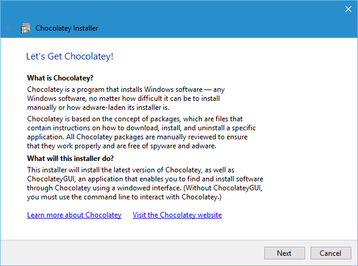
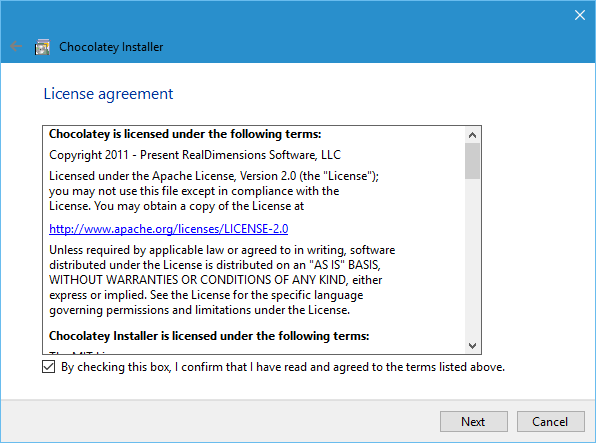
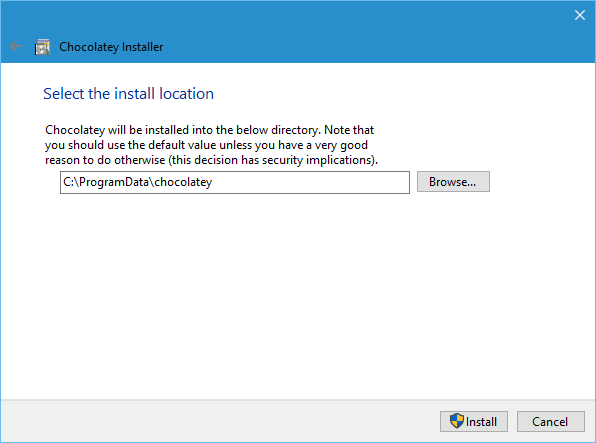

# Chocolatey Installer

This application is a GUI installer for [Chocolatey](https://chocolatey.org).
It is mainly built in C#, with a C++-based launcher. This application installs
the latest version of the Chocolatey CLI tool, as well as the latest version of
the [ChocolateyGUI](https://github.com/chocolatey/ChocolateyGUI) application.

## Screenshots

